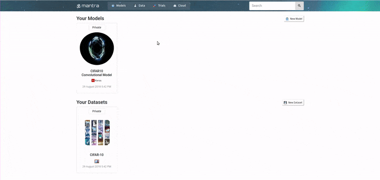

<div align="center">
        
</div>

-----------------------------------------

[](https://circleci.com/gh/RJT1990/mantra)
[](https://badge.fury.io/py/mantraml)
[](https://gitter.im/mantraml/Lobby)
[](http://mantra.readthedocs.io/en/latest/?badge=latest)


**mantra** is a rapid development framework for deep learning. 

**Problem**: Every ML project needs a way to train, track and share models. But every project does it in a different way with a lot of boilerplate code being needlessly reinvented. 

**Solution**: mantra is a framework for writing dataset and model classes that enables single line training, has a tracking UI, and makes it easy to encapsulate and share results. 

**Key Features**:

- Boilerplate classes for common dataset and model types
- Command-line interface for training with parameter parsing
- Automatic provisioning of cloud instances for remote training
- UI for monitoring training, comparing experiments and storing media
- Encapsulation of datasets and models by design, enabling easy sharing 

This is an alpha release. Join us on Gitter, Slack and Github. All contributions are welcome! 

[You can read the docs here](http://mantra.readthedocs.io/en/latest/).

-----------------------------------------

<div align="center">

</div>
<br><br>

## Get Started 

🚀 To launch your first Mantra project, execute the following to create a new project directory:

```console
mantra launch my_project 
```
☁ Configure your cloud settings and API keys:

```console
cd my_project 
mantra cloud 
```
💾 Get the example datasets and models from [here](https://github.com/RJT1990/mantra-examples):
 
```console
mantra import https://github.com/RJT1990/mantra-examples.git
``` 

🤖 Here are the example models you can train:

```console
mantra train relativistic_gan --dataset decks --cloud --dev --image-dim 256 256
```

```console
mantra train log_reg --dataset epl_data --target home_win --features feature_1 feature_2 feature_3 
```

🚂 During training, you can spin up the Mantra UI to track the progress:

```console
mantra ui
```

## Installation

To install mantra, you can use pip:

```
pip install mantraml
```
You should also have TensorFlow or PyTorch installed depending on which framework you intend to use.

Mantra is tested on Python 3.5+. It is not currently supported on Windows, but we'll look to get support in the near future.

### AWS Dependencies

You will need to install AWS CLI as a dependency. 

1. Login to AWS through a browser, click your name in the menubar and click My Security Credentials.

2. Create a new Access Key and make a note of the **Access Key ID** and **Secret Access Key**.

3. From terminal enter the following:

```console
johnsmith@computer:~$ pip install awscli
johnsmith@computer:~$ aws configure
```

Once prompted, enter your AWS details and your default region (e.g. *us-east-1*).

4. Now your credentials will be accessible by the **boto3** AWS SDK library, which will allow **Mantra** to be used to 
provision cloud instances on your request.

5. Use *mantra cloud* from your mantra project root to configure your cloud settings.

You should also ensure you are happy with the default instance settings in mantra - you can check this in the *settings.py* file in your project root. 

## Sharing on Mantrahub

Visit [Mantrahub](http://www.mantrahub.io) to share mantra components like models and datasets with our open source community. To import models or datasets:

```console
mantra import RJT1990/models/wgangp
```

```console
mantra import RJT1990/data/decks
```

To upload models, datasets or results to mantrahub:

```console
mantra upload data/decks
```

```console
mantra upload models/wgangp
```

```console
mantra upload results/celebagan
```

### Have Fun

> Arise! Awake! Approach the great and learn.

> Like the sharp edge of a razor is that path,

> so the wise say−hard to tread and difficult to cross.

